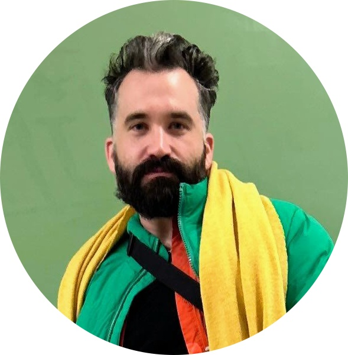

---
title: "Home"
page-layout: article
---

  

# Dr. Antonio Rojas Castro

I am a digital humanities researcher working at the intersection of humanities scholarship, research data management and digital infrastructures. My work focuses on the creation, organisation and analysis of structured textual data, particularly in the context of historical and literary corpora.

I have extensive experience in the development of digital editions, corpus-based research and reproducible workflows using technologies such as XML/TEI, XSLT, Python and Jupyter. I have worked in several international research projects based in Germany, contributing to the design of digital infrastructures, the documentation of workflows and the development of open research resources.

Beyond my research, I am interested in how digital methods can support cultural heritage institutions, libraries and research infrastructures in making complex textual collections more accessible and reusable.

You can found more information about my work at:

- [ORCID](https://orcid.org/0000-0002-8916-4997)  
- [Google Scholar](https://scholar.google.com/citations?user=vVidxOUAAAAJ&hl=en)
- [Researchgate](https://www.researchgate.net/profile/Antonio-Rojas-Castro?ev=hdr_xprf)
- [GitHub](https://github.com/arojascastro)  
- [Zotero](https://www.zotero.org/antoniorojascastro)

