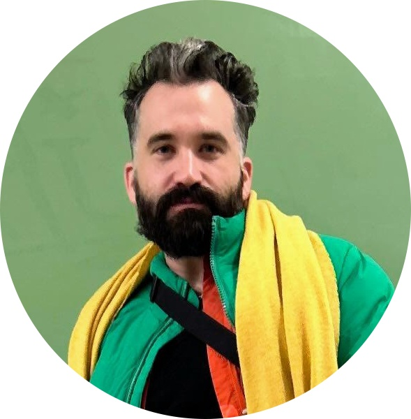

---
title: "Dr. Antonio Rojas Castro"
page-layout: article
---

  

# Dr. Antonio Rojas Castro
**Digital Humanities · Research Data Management · Open Science · Digital Collections**

I am a Digital Humanities and research data specialist with more than ten years of experience in international research projects. I work at the intersection of humanities scholarship, structured data and digital research infrastructures, with a particular focus on historical and literary collections.

My expertise includes digital scholarly editions, corpus development, metadata and data modelling, research data documentation, and reproducible workflows using XML/TEI, XSLT, Python, Jupyter and Git. I have contributed to collaborative digital resources and infrastructures at universities and research institutions in Germany.

My work helps research projects, libraries and cultural heritage organisations make complex textual collections accessible, interoperable and reusable. I am particularly interested in roles involving research data management, Open Science, digital collections and the coordination of digital research services.

Find out more about my work:

- [Curriculum Vitae](cv.qmd)
- [Selected Publications and Digital Outputs](publications.qmd)
- [GitHub](https://github.com/arojascastro)
- [ORCID](https://orcid.org/0000-0002-8916-4997)
- [Google Scholar](https://scholar.google.com/citations?user=vVidxOUAAAAJ&hl=en)
- [ResearchGate](https://www.researchgate.net/profile/Antonio-Rojas-Castro?ev=hdr_xprf)
- [Zotero](https://www.zotero.org/antoniorojascastro)

## Contact

- [Contact me](mailto:rojas.castro.antonio@gmail.com)

